# 멋쟁이 사자처럼 파이널 프로젝트 6팀 🕧6PM

<a href="https://final-6-6-pm.vercel.app/intro" target="_blank" title="여행도감소개페이지">
  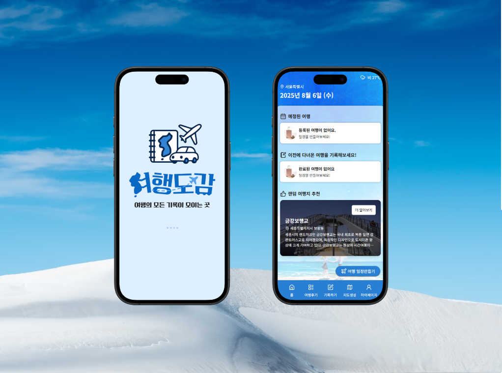
</a>

<br />

## 📋 프로젝트 개요

사용자는 여행 일정을 시/도 단위로 계획하고, 네이버 지도 API를 통해 각 위치를 지도에서 시각적으로 확인할 수 있으며, 친구들과 손쉽게 일정을 공유할 수 있습니다.
여행을 다녀온 후에는 전체 여행, 일자별, 장소별로 후기를 남길 수 있어 보다 풍부한 기록이 가능하며, 이를 다른 사용자들과 나눌 수 있습니다.
또한 대한민국 지도를 기반으로 지역별 사진을 첨부해 나만의 여행 지도를 만들어가는 특별한 경험도 제공합니다.

<br />

## 📅 프로젝트 기간

2025.07.07 ~ 2025.08.07

<br />

## 👥 팀원 소개

|                                                                      |                                                                  |                                                                  |                                                                      |
| :------------------------------------------------------------------------------------------------------------------------------------: | :--------------------------------------------------------------------------------------------------------------------------------: | :--------------------------------------------------------------------------------------------------------------------------------: | :------------------------------------------------------------------------------------------------------------------------------------: |
|                                                               **박선영**                                                               |                                                             **문서인**                                                             |                                                             **송아현**                                                             |                                                               **차형주**                                                               |
|                                                               팀장 / PM                                                                |                                                                 PL                                                                 |                                                               UX/UI                                                                |                                                               Documenter                                                               |
| [](https://github.com/seonyoungg) | [](https://github.com/SeOinm) | [](https://github.com/ineahe) | [](https://github.com/HyungJuCha) |

<br />

## 🛠️ 프로젝트 개발도구

| 분류                  | 사용 기술                                                                                                                                                                                                                                                                                                                                                                                                                                                                                              |
| --------------------- | ------------------------------------------------------------------------------------------------------------------------------------------------------------------------------------------------------------------------------------------------------------------------------------------------------------------------------------------------------------------------------------------------------------------------------------------------------------------------------------------------------ |
| **언어 / 라이브러리** |      |
| **프레임워크**        |                                                                                                                                                                                                                                                                                                                                                                                                         |
| **서버 / 배포**       |                                                                                                                                                                                                                                                                                                                   |
| **협업**              |                                                                                                                                                                                                                 |
| **디자인**            |                                                                                                                                                                                                                                                                                                                                                                                                               |

<br />

## 📁 프로젝트 폴더 구조

```
📁 api/                              # 외부 서버와 통신하는 API 요청 함수(브루노, DB 초기화 등)
📁 public/                           # 정적 파일(이미지, 아이콘 등)
📁 src/
├──📁 app/                           # 주요 페이지 라우팅 폴더
│   ├──📁 auth/                      # 로그인 및 회원가입 페이지
│   ├──📁 feed/                      # 여행 후기 피드 페이지
│   ├──📁 home/                      # 사용자 메인 홈
│   ├──📁 intro/                     # 서비스 소개 페이지
│   ├──📁 mypage/                    # 마이페이지(내 정보, 북마크 등)
│   ├──📁 photomap/                  # 나만의 여행 지도 페이지
│   ├──📁 plan/                      # 여행 일정 생성 및 조회 페이지
│   └──📁 review/                    # 여행 후기 작성 및 수정 페이지
│
├──📁 components/                    # UI 컴포넌트 모음(공통 및 페이지별)
├──📁 data/                          # API 요청 관련 함수
├──📁 hook/                          # 커스텀 React 훅 모음
├──📁 lib/                           # 공통 유틸 함수 및 라이브러리
├──📁 lottie/                        # Lottie 애니메이션 JSON 파일
├──📁 styles/                        # 전역 스타일 및 공통 스타일 정의
├──📁 types/                         # TypeScript 타입 정의 모음
├──📁 zustand/                       # Zustand 기반 전역 상태 관리
│
📄 .gitignore                        # Git에 포함되지 않아야 할 항목 목록
⚙️ prettier.cjs                      # Prettier 코드 스타일 설정
⚙️ eslint.config.mjs                 # ESLint 설정
⚙️ tsconfig.json                     # TypeScript 설정 파일
⚙️ next.config.ts                    # Next.js 설정 파일
⚙️ package.json                      # 프로젝트 의존성 및 스크립트 정의
⚙️ package-lock.json                 # 설치된 패키지 버전 고정 정보
📘 README.md                         # 프로젝트 소개
```

## ⭐ 핵심 기능 및 페이지 구성

- **홈 화면**

  - 오늘 날짜 및 날씨 표시
  - 예정/완료 일정 관리
  - 랜덤 여행지 추천

- **여행 일정 계획**

  - 지역 및 여행 기간 선택
  - 날짜별 방문지 추가 및 지도 기반 일정 계획

- **여행지 리뷰**

  - 리뷰 검색, 북마크, 댓글 기능 제공
  - 다양한 사용자와 소통 및 정보 탐색

- **기록하기**

  - 여행 일정 기반 기록 작성 (장소 정보, 제목, 내용, 사진, 태그, 별점)

- **나만의 여행 지도**

  - 대한민국 지도에 다녀온 지역 클릭 및 여행 사진 업로드
  - 완성된 커스텀 지도 다운로드

- **마이페이지**
  - 작성 글 조회수/좋아요 수 확인
  - 북마크한 글, 작성 리뷰, 전체 여행 일정 관리

<br />

## 📱 페이지별 기능

### 1. 홈

- 홈 화면에서는 오늘의 날씨와 함께 예정된 여행 일정을 바로 확인할 수 있습니다.
- 랜덤 여행지 추천을 통해 새로운 여행 아이디어를 얻거나, 여행 일정 만들기 버튼으로 새로운 여행을 계획할 수 있습니다.
- 로그인이 필요한 기능에 접근하면 자동으로 로그인 페이지로 이동합니다.

| 홈 화면                                                                 | 로그인                                                                 |
| ----------------------------------------------------------------------- | ---------------------------------------------------------------------- |
|  | 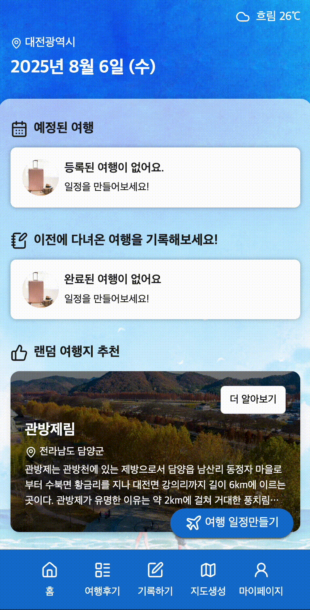 |

<br />

### 2. 여행 일정

- 가고 싶은 지역과 여행 기간을 정한 뒤, 날짜별로 방문지를 추가할 수 있습니다.
- 추가한 장소는 지도와 함께 확인할 수 있습니다.

| 지역선택                                                                | 날짜선택                                                                 | 장소선택                                                                 | 일정확인                                                                   | 일정등록 성공                                                                |
| ----------------------------------------------------------------------- | ------------------------------------------------------------------------ | ------------------------------------------------------------------------ | -------------------------------------------------------------------------- | ---------------------------------------------------------------------------- |
| 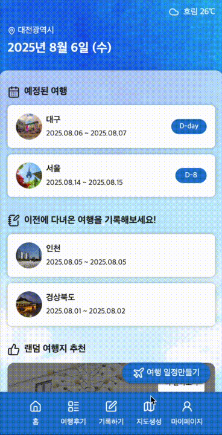 | 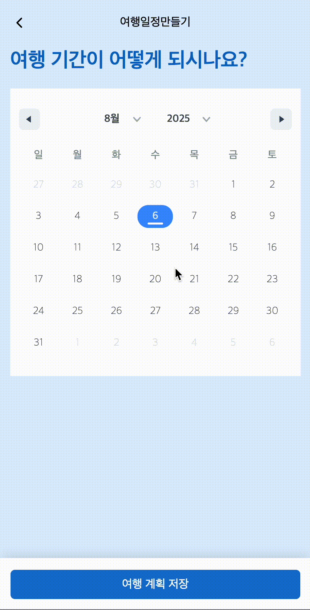 | 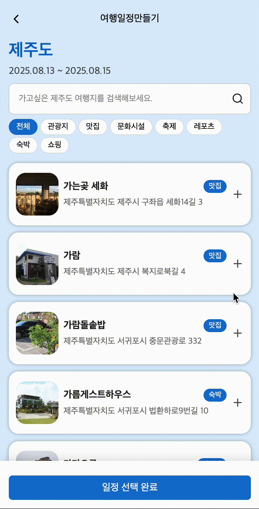 | 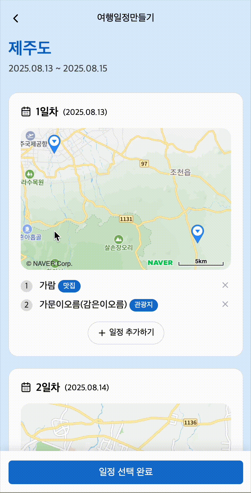 | 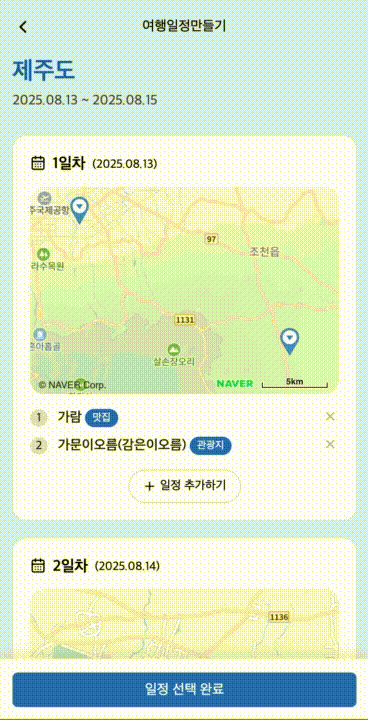 |

<br />

### 3. 여행 피드

- 검색, 북마크 기능으로 다른 사용자의 리뷰를 자유롭게 검색하고 저장할 수 있습니다.
- 댓글 기능으로 다른 사용자와 소통할 수 있습니다.
- 여행 리뷰 하단에 리뷰와 관련된 여행 일정 정보를 추가로 확인할 수 있습니다.

| 피드                                                                | 리뷰와 관련된 여행일정                                                            |
| ------------------------------------------------------------------- | --------------------------------------------------------------------------------- |
| 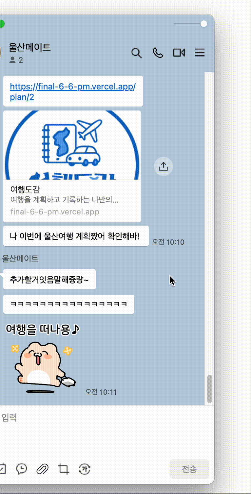 |  |

<br />

### 4. 여행 기록

- 여행 일정을 기반으로 완료된 여행에 대해 장소 정보, 제목, 내용, 사진, 태그, 별점을 추가하여 생생한 기록을 작성할 수 있습니다.

| 기록하기                                                                  | 기록완료                                                                   |
| ------------------------------------------------------------------------- | -------------------------------------------------------------------------- |
| 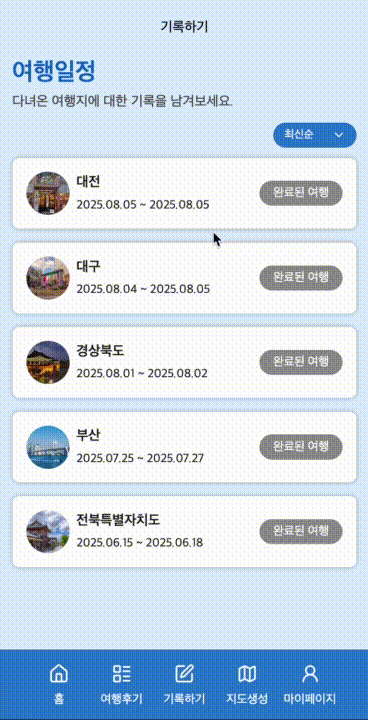 | 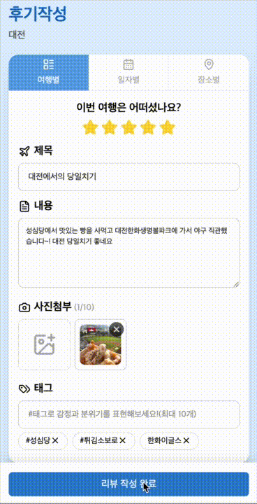 |

<br />

### 5. 나만의 지도

- 지도에 다녀온 지역을 클릭하여 여행 사진을 업로드하고, 완성된 커스텀 지도를 다운로드 할 수 있습니다.

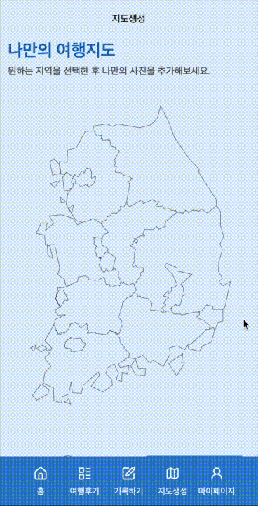

<br />

### 6. 여행 일정 공유

- 버튼을 통해 여행 일정을 링크로 간편하게 공유할 수 있습니다.


### 7. 마이페이지

- 작성한 글의 조회수와 좋아요 수 확인, 북마크한 글과 작성한 리뷰 관리, 전체 여행 일정을 한눈에 볼 수 있습니다.

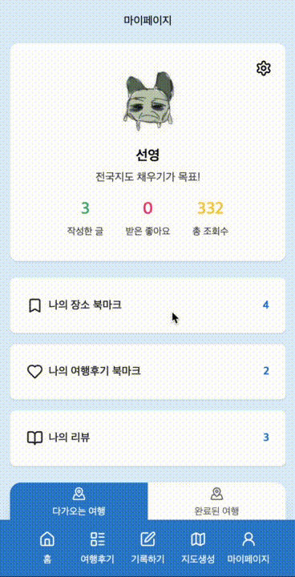

<br />

## 👩‍💻 업무 분담

| 이름   | 기능                                                                                                                                                                                                                                                   |
| ------ | ------------------------------------------------------------------------------------------------------------------------------------------------------------------------------------------------------------------------------------------------------ |
| 박선영 | - 여행 후기 페이지 전반 담당<br>- 여행 후기 등록 / 수정 / 삭제 / 조회 기능 구현<br>- 회원 정보 등록 및 수정, 로그인 기능 구현<br>- 여행 일정 공유 기능 구현<br>- 메인 페이지에서 현재 위치 확인 및 주소 변환 기능 구현                                 |
| 문서인 | - 여행 일정 페이지 전반 담당<br>- 여행 일정 등록 / 수정 / 삭제 기능 구현<br>- 여행 일자별 등록 / 수정 / 삭제 기능 구현<br>- 여행 일정 검색 페이지에 관광 API 연동<br>- 메인 페이지 랜덤 여행지 추천 기능 구현<br>- 네이버 지도 API 기반 위치 연동 처리 |
| 송아현 | - 전체 피그마 디자인 작업<br>- 여행 후기 데이터 연동 및 필터링 기능<br>- 댓글 등록 / 수정 / 삭제 기능<br>- 404 Not Found 페이지 구성<br>- 인덱스 페이지 구성                                                                                           |
| 차형주 | - 지도 생성 페이지 전반 담당<br>- 지역 SVG 기반 이미지 업로드 + 회원 정보 수정 연동<br>- 여행 후기 게시물 북마크 등록 / 삭제 / 조회 기능<br>- 프로젝트 README 작성<br>- GitHub Wiki 문서화                                                             |

<br />
